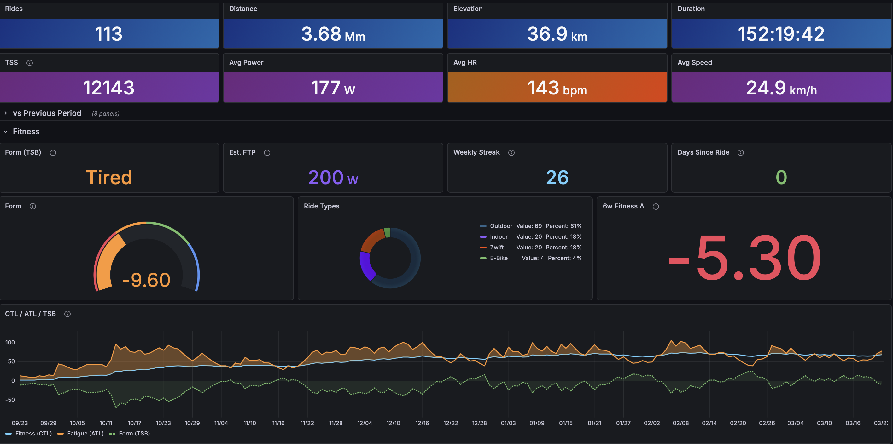
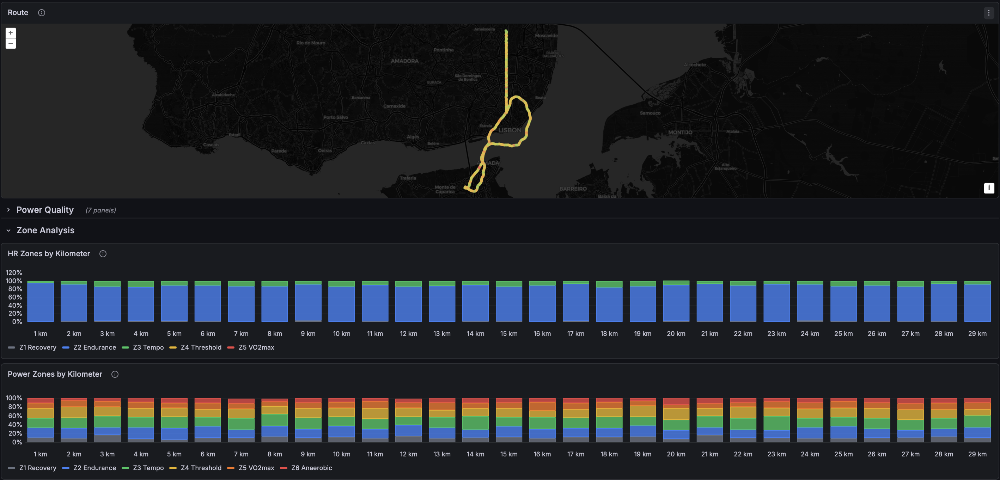
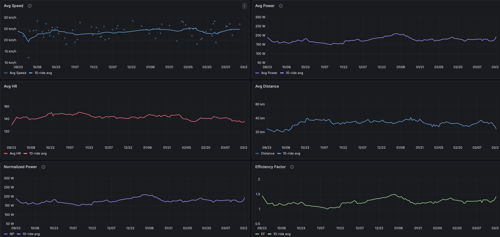
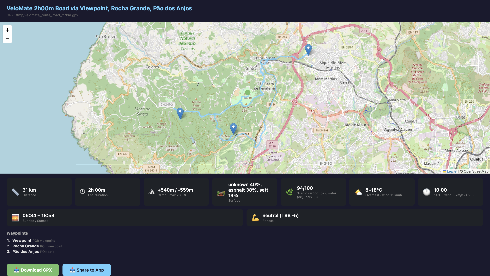

# VeloMate 🚴

[](https://github.com/elduty/velomate/actions/workflows/test.yml)
[](https://codecov.io/gh/elduty/velomate)
[](https://www.python.org/downloads/)
[](LICENSE)
[](https://grafana.com/)
[](https://ko-fi.com/elduty)

A self-hosted cycling data platform — automatic ride ingestion from Strava, Grafana dashboards for analytics, and intelligent route planning. **No Strava Premium required** — all metrics (fitness, power zones, training load, TRIMP) are computed locally from raw data.

Inspired by [TeslaMate](https://github.com/teslamate-org/teslamate). Works with any device that syncs to Strava.



## Features

### Data Ingestion
- Polls Strava every 10 minutes for new cycling rides
- **Cycling only** — Ride, VirtualRide, and EBikeRide are ingested. Runs, swims, walks, strength, and all other Strava activity types are filtered out at sync
- Classifies rides as: **Outdoor**, **Zwift**, **Indoor** (trainer), or **E-Bike** — dashboards can filter by type
- Stores full per-second telemetry (HR, power, cadence, speed, altitude, GPS)
- Calculates CTL/ATL/TSB fitness metrics locally (no Strava Premium needed)
- TRIMP (Training Impulse) computed from HR stream data with HRR capped at 1.0 (no Strava Premium needed)
- Normalized Power (NP), Intensity Factor (IF), Variability Index (VI), Efficiency Factor (EF), and Work (kJ) pre-calculated per activity from stream data
- All derived metrics computed by the ingestor and stored — Grafana reads stored values (single source of truth)
- FTP auto-estimated from rolling 90-day best 20-minute power, or configured manually via `VELOMATE_FTP`
- Daily fitness recalculation at 00:05 (rest days show CTL/ATL decay)
- Smart deduplication when multiple devices record the same ride

**Metric availability by ride type:**

| Metric | Outdoor | Zwift | Indoor (trainer) | E-Bike |
|--------|---------|-------|------------------|--------|
| GPS route map | Yes | No | No | Yes |
| Power zones / NP / EF | With power meter | Yes (virtual power) | With smart trainer | No |
| HR zones / TRIMP | With HR monitor | With HR monitor | With HR monitor | With HR monitor |
| Speed / distance | Yes | Virtual | No (0 km) | Yes |
| Elevation | Yes | Virtual | No | Yes |
| Per-km zone breakdown | Yes | Yes | No (no distance) | Yes |

### Grafana Dashboards

Three dashboards with 98 panels across 12 visualization types.

**Overview** (34 panels) — your training hub
- 12 stat cards with period comparison + sport type filter
- 8 delta comparison cards (vs previous period)
- Fitness section: CTL/ATL/TSB with fill-between shading, FTP, TSB gauge, weekly streak, 6-week fitness delta
- 10 daily charts split by ride type (Outdoor/Zwift/E-Bike/Indoor)
- Ride type donut, ride frequency bar chart
- Outdoor records table (period best vs all-time best)
- Activities table with drill-down to Activity Details
- Lifetime ride heatmap
- Manual annotations for marking events (races, FTP tests, injuries)



**Activity Details** (32 panels) — per-ride deep dive
- 12 summary stat cards + 7 advanced metrics (NP, IF, VI, EF, Work, TRIMP, aerobic decoupling)
- GPS route map with speed/HR/power color overlay
- HR and power zones by kilometer (stacked bar charts)
- HR and power zone distribution (Coggan model, zone-colored)
- Power vs HR scatter plot (cardiac drift detection)
- Power zone bands on HR & Power telemetry
- Speed & elevation / HR & power / cadence & grade telemetry (distance-based x-axis)
- Per-km splits table with best/worst markers
- Power duration curve



**All Time Progression** (32 panels) — long-term trends
- 6 stat cards: total distance, elevation, rides, hours, current FTP, peak CTL
- 6 progression scatter plots with 10-ride rolling averages and regression lines (speed, power, NP, EF, HR, distance)
- FTP progression (monthly estimated from stream data)
- Best efforts (1min/5min/20min peak power per ride)
- Weekly power range (candlestick — week-over-week comparison)
- Training zone polarization (monthly power + HR zone stacked bars)
- CTL/ATL/TSB fitness history with fill-between shading
- 6 cumulative totals (distance, elevation, duration, rides, TSS, calories)
- Monthly trends stacked by ride type
- Year-over-year distance comparison
- Annual totals table
- Personal records with drill-down links
- All-time ride map



### Intelligent Route Planning
- Generates real road-following GPX loops via [Valhalla](https://github.com/valhalla/valhalla) (free, OpenStreetMap-based)
- Generates GPX files with interactive browser preview (map + route stats + download/share buttons)
- On iOS/Android, the share button opens the native share sheet to send the GPX directly to any bike computer app
- `--output DIR` saves the preview HTML to a directory for headless/server use
- Smart waypoint selection from 10 data sources (see below)
- Weather-aware: best ride time, UV warnings, wind direction analysis
- Safety control: `--safety` flag adjusts preference for bike lanes vs main roads
- Configurable avoid zones for roads/areas you don't want to ride

## Route Intelligence — 10 Data Sources

When planning a route, VeloMate selects waypoints and enriches the output using:

| # | Source | Data | API |
|---|--------|------|-----|
| 1 | **OpenStreetMap POIs** | Viewpoints, cafes, peaks, water fountains, bike shops | Overpass (free) |
| 2 | **Strava segments** | Popular cycling roads near you | Strava API |
| 3 | **Komoot highlights** | Community-curated cycling POIs | Vector tiles (free, no auth) |
| 4 | **Your ride history** | 30-day GPS density grid — variety or comfort mode | Local DB |
| 5 | **OSM surface tags** | Road surface verification (asphalt, gravel, etc.) | Overpass (free) |
| 6 | **OSM cycling infrastructure** | Bike lanes, speed limits, traffic calming → safety score | Overpass (free) |
| 7 | **Open-Meteo weather** | Temperature, wind, UV, rain + hourly forecast | Open-Meteo (free) |
| 8 | **Open-Meteo air quality** | European AQI, PM2.5, PM10 | Open-Meteo (free) |
| 9 | **Open Topo Data** | Elevation profile, climb/descent, max gradient | Open Topo Data (free) |
| 10 | **Sunrise/Sunset** | Daylight safety, golden hour | sunrise-sunset.org (free) |

Additionally, the route planner detects **waymarked cycling trails** (EuroVelo, national routes) along the generated path.

## Deduplication — Data Richness Scoring

When multiple devices record the same ride (e.g., a bike computer and a watch both syncing to Strava), VeloMate keeps the record with the richest data:

| Field | Score |
|-------|-------|
| Power data | +3 |
| Heart rate | +2 |
| Distance > 0 | +1 |
| Cadence | +1 |
| Calories | +1 |
| Elevation > 0 | +1 |

The record with the higher total score wins. Missing fields from the losing record (e.g., HR from a watch when a bike computer wins on power) are merged into the winner. This works with any device brand — no hardcoded priorities.

## Architecture

```
Any device → Strava → [Ingestor] → PostgreSQL → Grafana dashboards
                                        ↑
                            VeloMate CLI (route planning + recommendations)
                                        ↓
                              Valhalla → GPX file
```

Three Docker Compose services:

| Service | Image | Port |
|---------|-------|------|
| PostgreSQL | `postgres:15` | 5423 |
| Ingestor | custom Python 3.11 | — |
| Grafana | `grafana/grafana:12.4` | 3021 |

The CLI runs locally and connects to the database over the network.

## Quick Start

### 1. Clone and configure

```bash
git clone https://github.com/elduty/velomate.git
cd velomate
cp .env.example .env
# Edit .env with your Strava API credentials and passwords
```

### 2. Get a Strava refresh token

```bash
# Open in browser (replace YOUR_CLIENT_ID):
# https://www.strava.com/oauth/authorize?client_id=YOUR_CLIENT_ID&response_type=code&redirect_uri=http://localhost&approval_prompt=force&scope=activity:read_all

# After authorizing, exchange the code:
curl -X POST https://www.strava.com/oauth/token \
  -d client_id=YOUR_CLIENT_ID \
  -d client_secret=YOUR_CLIENT_SECRET \
  -d code=CODE_FROM_REDIRECT \
  -d grant_type=authorization_code
# Use the refresh_token from the response
```

### 3. Start services

```bash
docker compose up -d
```

On first run, the ingestor backfills the last 12 months of Strava activities.

### 4. Set up the CLI

```bash
pip install -r requirements.txt
cp config.example.yaml ~/.config/velomate/config.yaml
# Edit with your home coordinates, DB host, and Strava credentials
```

Credentials support three methods: direct values, environment variables, or shell commands (`password_cmd`) for secret managers like Keychain, 1Password, or Vault.

## CLI Usage

```bash
# Weekly ride recommendation (fitness + weather + past routes)
python3 -m velomate.cli

# Plan a route
python3 -m velomate.cli plan --duration 2h
python3 -m velomate.cli plan --distance 50km --surface gravel
python3 -m velomate.cli plan --duration 3h --waypoints "Sintra,Cascais"
python3 -m velomate.cli plan --duration 1h --surface mtb --safety 1.0
python3 -m velomate.cli plan --distance 30 --preference comfort

# Plan a route to a destination
python3 -m velomate.cli plan --destination Cascais
python3 -m velomate.cli plan --destination "38.69,-9.42" --surface gravel

# Destination with waypoints along the way
python3 -m velomate.cli plan --destination Cascais --waypoints "Oeiras;Estoril"

# There-and-back via destination
python3 -m velomate.cli plan --destination Cascais --loop

# Padded to target distance
python3 -m velomate.cli plan --destination Cascais --distance 50km
```

### Plan flags

| Flag | Default | Description |
|------|---------|-------------|
| `--duration` | * | Ride time (`2h`, `1h30m`, `90min`) |
| `--distance` | * | Target distance (`30`, `50km`) |
| `--destination` | — | End point — place name or `lat,lng`. Auto-disables loop |
| `--surface` | `road` | `road`, `gravel`, or `mtb` |
| `--safety` | `0.5` | 0.0 = fastest, 1.0 = safest (prefers bike lanes) |
| `--preference` | `variety` | `variety` (new roads) or `comfort` (familiar) |
| `--waypoints` | — | Semicolon-separated locations (`Cascais;38.7,-9.14;Sintra`) |
| `--date` | `tomorrow` | When to ride (`today`, `saturday`, `2026-03-20`) |
| `--time` | — | Start time (`14:00`, `2pm`, `9am`) |
| `--start` | from config | Start location — place name or `lat,lng` |
| `--loop` | true** | Round-trip route |
| `--output DIR` | — | Save preview HTML to directory (instead of opening browser) |

\* Provide `--duration` or `--distance` (one required unless `--destination` is set, mutually exclusive). \*\* Loop defaults to false when `--destination` is set.

### Example output

```
🗺 *VeloMate 2h00m Road via Miradouro de Porto Salvo, Cotão, Viewpoint*
  📏 24 km
  📅 2026-03-16 at 09:00
  🛤 Surface: asphalt 53%, unknown 44%, paving_stones 2%
  ⛰ Climb: +260m / -284m (max gradient 10.2%)
  🌿 Scenic: wood (25), water (10), park (4) (86/100)
  🛡 Safety: bike lanes 22% (11/100)
  🌤 Mainly clear, 10-21°C, wind 12 km/h
  🕐 Best time: 09:00 (14°C, wind 10 km/h, UV 2)
  🌅 Sunrise 06:45, sunset 18:46
  💪 neutral (TSB -4)
  💾 GPX: /tmp/velomate_route_road_29km.gpx
```

## Fitness Metrics

```
Power TSS = (duration_s × NP × IF) / (FTP × 3600) × 100   (preferred)
HR TSS    = (duration_h) × (avg_hr / threshold_hr)² × 100  (fallback)
CTL       = 42-day EMA of daily TSS   (chronic training load / fitness)
ATL       = 7-day EMA of daily TSS    (acute training load / fatigue)
TSB       = CTL − ATL                 (training stress balance / form)
```

- **NP**: Normalized Power — 30-second SMA (circular buffer), 4th power, mean, 4th root. Matches GoldenCheetah IsoPower (Coggan standard)
- **IF**: Intensity Factor = NP / FTP. Uses per-ride FTP for historical accuracy
- **VI**: Variability Index = NP / avg power. Higher = more variable effort
- **EF**: Efficiency Factor = NP / avg HR. Rising EF indicates improving aerobic fitness
- **TRIMP**: Banister exponential formula from per-second HR data. HRR capped at 1.0 to prevent blowup when HR exceeds configured max
- **FTP**: auto-estimated from rolling 90-day best 20-minute power × 0.95, or configured via `VELOMATE_FTP`
- **Work**: Total energy output in kJ = sum of per-second power from stream data
- **Threshold HR**: 95th percentile of your max HRs, or configured via `VELOMATE_MAX_HR`
- **TSB interpretation**: > +10 fresh · -10 to +10 neutral · < -10 fatigued

## Database Schema

| Table | Contents |
|-------|----------|
| `activities` | Every ride — distance, duration, HR, power, cadence, elevation, calories, TSS, NP, IF, VI, EF, TRIMP, Work (kJ), ride FTP, sport type, device |
| `activity_streams` | Per-second telemetry — HR, power, cadence, speed, altitude, lat/lng |
| `athlete_stats` | Daily fitness metrics — CTL, ATL, TSB, weekly volume |
| `routes` | Legacy — created by schema but not actively written to |
| `sync_state` | Ingestor bookmarks (last synced timestamps) |

Schema is managed in code (`ingestor/db.py:create_schema()`) using `IF NOT EXISTS` / `ADD COLUMN IF NOT EXISTS`. No migration tool.

## Configuration

### Ingestor (Docker)

Configured via `.env` file:

| Variable | Required | Description |
|----------|----------|-------------|
| `POSTGRES_PASSWORD` | Yes | Database password |
| `STRAVA_CLIENT_ID` | Yes | From strava.com/settings/api |
| `STRAVA_CLIENT_SECRET` | Yes | From Strava API settings |
| `STRAVA_REFRESH_TOKEN` | Yes | OAuth refresh token |
| `GRAFANA_PASSWORD` | Yes | Grafana admin password |
| `VELOMATE_MAX_HR` | No | Your max heart rate (0 = auto-estimate) |
| `VELOMATE_FTP` | No | Your FTP in watts (0 = auto-estimate) |
| `VELOMATE_RESTING_HR` | No | Resting heart rate in bpm (default 50) |
| `VELOMATE_RESET_RIDE_FTP` | No | Set to `1` to reset all per-ride FTP values on next restart (one-shot) |

### CLI (local)

Configured via `~/.config/velomate/config.yaml` (see `config.example.yaml`):

- Home coordinates (required for route planning)
- Database connection
- Strava credentials (optional — enables popular segment data in route intelligence)
- Avoid zones (lat/lng areas to exclude from routes)

## Requirements

- Docker + Docker Compose (for ingestor, PostgreSQL, Grafana)
- Python 3.10+ (for CLI)
- A Strava account with API access

## License

[AGPL-3.0](LICENSE) — same license as [TeslaMate](https://github.com/teslamate-org/teslamate). Free to use, modify, and self-host. Modifications must be shared under the same license.
