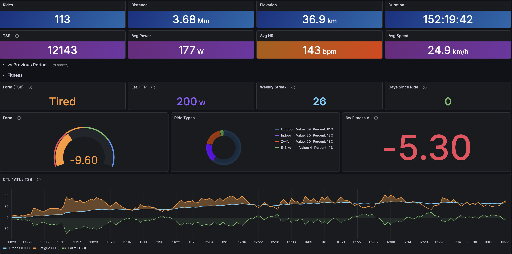
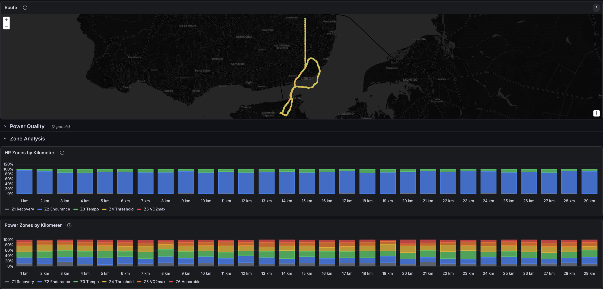
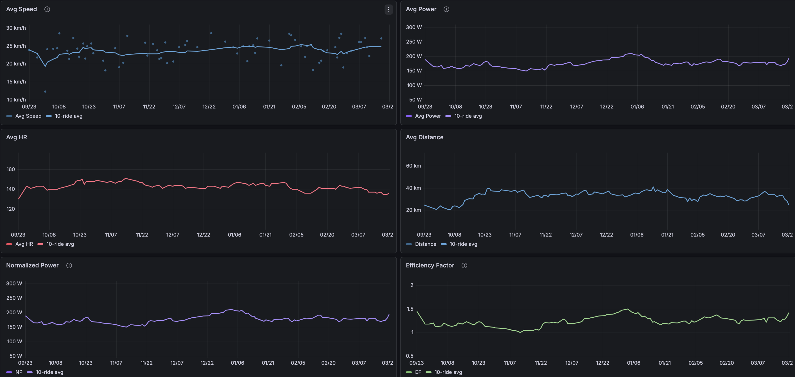
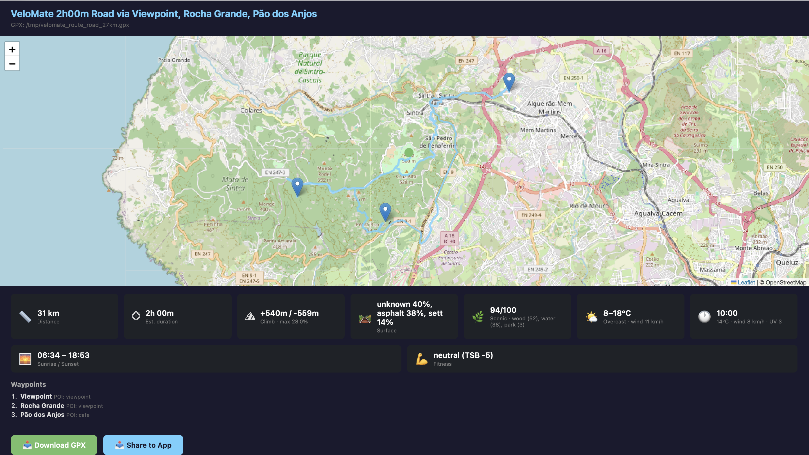

# VeloMate 🚴

[](https://github.com/elduty/velomate/actions/workflows/test.yml)
[](https://codecov.io/gh/elduty/velomate)
[](https://www.python.org/downloads/)
[](LICENSE)
[](https://grafana.com/)
[](https://ko-fi.com/elduty)

A self-hosted cycling data platform — automatic ride ingestion from **intervals.icu, Strava and/or Ride with GPS**, Grafana dashboards for analytics, and intelligent route planning. **No paid subscription required** — all metrics (fitness, power zones, training load, TRIMP) are computed locally from raw data. intervals.icu is the recommended source: it is free, and it relays Garmin, Wahoo, Zwift, Polar, Suunto and Coros, so VeloMate does not depend on Strava API access — which now requires a paid subscription.

Inspired by [TeslaMate](https://github.com/teslamate-org/teslamate). Works with any device that syncs to intervals.icu, Strava or Ride with GPS.



## Features

### Data Ingestion
- Polls intervals.icu (primary), Strava and/or Ride with GPS every 10 minutes (configurable) for new cycling rides — run any source on its own, or several with automatic cross-source deduplication of the same ride
- **Cycling only** — Ride, VirtualRide, and EBikeRide are ingested. Runs, swims, walks, strength, and all other Strava activity types are filtered out at sync
- Classifies rides as: **Outdoor**, **Zwift**, **Indoor** (trainer), or **E-Bike** — dashboards can filter by type
- Stores full per-second telemetry (HR, power, cadence, speed, altitude, GPS)
- Calculates CTL/ATL/TSB fitness metrics locally (no Strava Premium needed)
- TRIMP (Training Impulse) computed from HR stream data with HRR capped at 1.0 (no Strava Premium needed)
- Normalized Power (NP), Intensity Factor (IF), Variability Index (VI), Efficiency Factor (EF), Work (kJ), aerobic decoupling, and W/kg pre-calculated per activity from stream data
- VI-aware TSS: uses avg_power instead of NP when VI > 1.30 (urban stop-and-go rides) to prevent overestimation
- Auto interval detection: Coggan-style classification (sprint / anaerobic / vo2 / threshold / sweetspot / tempo) from power streams
- All derived metrics computed by the ingestor and stored — Grafana reads stored values (single source of truth)
- FTP auto-estimated from rolling 90-day best 20-minute power, or configured manually via `VELOMATE_FTP`
- Per-ride weight stored from `VELOMATE_WEIGHT` — enables W/kg tracking with historical preservation
- Daily fitness recalculation at 00:05 (rest days show CTL/ATL decay)
- Smart deduplication when multiple devices record the same ride

**Metric availability by ride type:**

| Metric | Outdoor | Zwift | Indoor (trainer) | E-Bike |
|--------|---------|-------|------------------|--------|
| GPS route map | Yes | No | No | Yes |
| Power zones / NP / EF | With power meter | Yes (virtual power) | With smart trainer | No |
| HR zones / TRIMP | With HR monitor | With HR monitor | With HR monitor | With HR monitor |
| Speed / distance | Yes | Virtual | No (0 km) | Yes |
| Elevation | Yes | Virtual | No | Yes |
| Per-km zone breakdown | Yes | Yes | No (no distance) | Yes |

> **No HR or power sensor?** A ride recorded with GPS only still shows distance, elevation, speed, the route map, and detected climbs. Training-load metrics — TSS, CTL/ATL/TSB, NP, IF, EF, VI, TRIMP, and power/HR zones — need a heart-rate or power sensor and read "N/A" without one.

### Grafana Dashboards

Three dashboards with 128 panels across 12 visualization types.

**Overview** (43 panels) — your training hub
- 10 period summary stats (Rides, Distance, Elevation, Duration, TSS, Avg Power, Avg HR, Avg Speed, Avg Decoupling, Calories) with sport type filter
- 10 delta comparison cards (vs previous period, including Δ Calories)
- Fitness section: CTL/ATL/TSB with fill-between shading and form-zone TSB colouring (overreached/fatigued/neutral/optimal/fresh/detraining), Configured + Estimated FTP side-by-side, TSB gauge, weekly streak, days since ride, 6-week fitness delta, ride type donut
- 6 trend charts (distance & elevation, duration & TSS, avg power & HR, avg speed & cadence, calories & rides, rolling weekly volume)
- Ride frequency bar chart
- Activities table with drill-down to Activity Details
- Default time range: 7 days



**Activity Details** (41 panels) — per-ride deep dive
- 12 summary stat cards + 8 advanced metrics (NP, IF, VI, EF, Work, TRIMP, aerobic decoupling, W/kg)
- GPS route map with speed/HR/power color overlay
- HR and power zones by kilometer (stacked bar charts)
- HR and power zone distribution (Coggan model, zone-colored)
- Power distribution histogram (25W buckets, 7-zone colored)
- Power vs HR scatter plot (cardiac drift detection)
- Power zone bands on HR & Power telemetry
- Speed & elevation / HR & power / cadence & grade telemetry (distance-based x-axis)
- Per-km splits table with best/worst markers
- Power duration curve
- Detected intervals table (Coggan-style: sprint / anaerobic / vo2 / threshold / sweetspot / tempo)



**All Time Progression** (44 panels) — long-term trends
- 6 stat cards: total distance, elevation, rides, hours, current FTP, peak CTL
- 8 progression scatter plots with 10-ride rolling averages (speed, power, NP, EF, HR, distance, aerobic decoupling, NP/kg)
- Athlete Type classification (sprinter/pursuiter/rouleur/time-triallist/climber from W'/CP ratio) and VO2max estimate (Storer formula from CP + weight), with a VO2max progression trend
- FTP progression (monthly estimated from stream data)
- Best efforts (1min/5min/20min peak power per ride)
- Weekly power range (candlestick — week-over-week comparison)
- Training zone polarization (monthly power + HR zone stacked bars + monthly interval distribution)
- CTL/ATL/TSB fitness history with fill-between shading and form-zone TSB colouring
- 6 cumulative totals (distance, elevation, duration, rides, TSS, calories)
- Monthly trends stacked by ride type
- Year-over-year distance comparison
- Annual totals table
- Personal records with drill-down links
- All-time ride map



### Intelligent Route Planning
- Generates real road-following GPX loops via [Valhalla](https://github.com/valhalla/valhalla) (free, OpenStreetMap-based)
- Generates GPX files with interactive browser preview (map + route stats + download/share buttons)
- On iOS/Android, the share button opens the native share sheet to send the GPX directly to any bike computer app
- `--output DIR` saves the preview HTML to a directory for headless/server use
- Smart waypoint selection from 10 data sources (see below)
- Weather-aware: best ride time, UV warnings, wind direction analysis
- Safety control: `--safety` flag adjusts preference for bike lanes vs main roads
- Configurable avoid zones for roads/areas you don't want to ride

## Route Intelligence — 10 Data Sources

When planning a route, VeloMate selects waypoints and enriches the output using:

| # | Source | Data | API |
|---|--------|------|-----|
| 1 | **OpenStreetMap POIs** | Viewpoints, cafes, peaks, water fountains, bike shops | Overpass (free) |
| 2 | **Strava segments** | Popular cycling roads near you | Strava API |
| 3 | **Komoot highlights** | Community-curated cycling POIs | Vector tiles (free, no auth) |
| 4 | **Your ride history** | 30-day GPS density grid — variety or comfort mode | Local DB |
| 5 | **OSM surface tags** | Road surface verification (asphalt, gravel, etc.) | Overpass (free) |
| 6 | **OSM cycling infrastructure** | Bike lanes, speed limits, traffic calming → safety score | Overpass (free) |
| 7 | **Open-Meteo weather** | Temperature, wind, UV, rain + hourly forecast | Open-Meteo (free) |
| 8 | **Open-Meteo air quality** | European AQI, PM2.5, PM10 | Open-Meteo (free) |
| 9 | **Open Topo Data** | Elevation profile, climb/descent, max gradient | Open Topo Data (free) |
| 10 | **Sunrise/Sunset** | Daylight safety, golden hour | sunrise-sunset.org (free) |

Additionally, the route planner detects **waymarked cycling trails** (EuroVelo, national routes) along the generated path.

## Deduplication — Data Richness Scoring

When multiple devices record the same ride (e.g., a bike computer and a watch both syncing to Strava), VeloMate keeps the record with the richest data:

| Field | Score |
|-------|-------|
| Power data | +3 |
| Heart rate | +2 |
| Distance > 0 | +1 |
| Cadence | +1 |
| Calories | +1 |
| Elevation > 0 | +1 |

The record with the higher total score wins. Missing fields from the losing record (e.g., HR from a watch when a bike computer wins on power) are merged into the winner. This works with any device brand — no hardcoded priorities.

## Architecture

```
Any device → intervals.icu / Strava / Ride with GPS → [Ingestor] → PostgreSQL → Grafana dashboards
                                                           ↑
                                    VeloMate CLI (route planning + recommendations)
                                                           ↓
                                                  Valhalla → GPX file
```

Three Docker Compose services:

| Service | Image | Port |
|---------|-------|------|
| PostgreSQL | `postgres:15` | 5423 |
| Ingestor | custom Python 3.11 | — |
| Grafana | `grafana/grafana:12.4` | 3021 |

The CLI runs locally and connects to the database over the network.

## Quick Start

### 1. Clone and configure

```bash
git clone https://github.com/elduty/velomate.git
cd velomate
cp .env.example .env
# Edit .env with your activity source credentials and passwords
```

### 2. Connect an activity source

Configure at least one. Several can run together — the same ride arriving from
more than one is deduplicated automatically, with intervals.icu taking
precedence.

#### intervals.icu (recommended)

Free, with a documented API, and it relays Garmin Connect, Wahoo, Zwift, Polar,
Suunto and Coros — so VeloMate needs no Strava API access of its own.

1. Sign in at [intervals.icu](https://intervals.icu) → **Settings**
2. Scroll to **Developer Settings** — your **athlete ID** (`iNNNNNN`) and
   **API key** are both on that page
3. Add them to `.env` as `INTERVALS_ICU_ATHLETE_ID` and `INTERVALS_ICU_API_KEY`

**One caveat worth knowing:** activities that reached intervals.icu *via
Strava* cannot be served back through their API — Strava's terms forbid third
parties re-serving Strava data — so those are skipped and reported per batch.
Upload to intervals.icu directly, or sync your head unit to it, for full
coverage.

##### Zwift rides — connect Zwift to intervals.icu directly

**intervals.icu → Settings → Zwift → Connect.** Zwift and intervals.icu have an
official integration built on Zwift's Training API: completed rides download
automatically, **Download Old Data** backfills up to a year, and planned
workouts sync the other way into your Zwift workout library. Nothing runs on
your machine and nothing depends on Strava.

The alternatives below are recorded because they look workable and are not.

**Relaying through Garmin or Wahoo does not work.** Both deliberately refuse to
forward third-party-sourced activities to other platforms, so a Zwift ride that
lands in Garmin Connect or the Wahoo app never reaches intervals.icu at all.

**Strava holds the ride, but neither way of getting it out is open.** These are
two alternative routes, each blocked for its own reason — opening either one
would be enough:

- *Via intervals.icu.* The ride arrives there, but as one of the unavailable
  stubs described above, which intervals.icu may not re-serve through its API.
- *Straight from Strava.* VeloMate could read the original FIT directly, but
  Strava's API now requires a paid subscription. Buying one reopens this route.

(intervals.icu can also bulk-import a full Strava history as original FIT files.
That is a one-off account export, not a sync route.)

**If the direct connection is ever unavailable**, Zwift writes every completed
ride to `~/Documents/Zwift/Activities`, and intervals.icu accepts both a manual
upload and a watched Dropbox folder (**Settings → Dropbox → Connect → Add
Folder**). Either gets a ride in without any custom tooling.


#### Ride with GPS

1. Go to [ridewithgps.com](https://ridewithgps.com) → account settings → **Developers** tab
2. Create an API client — this gives you the **API key**
3. Generate an **auth token** for your account on the same page
4. Add both to `.env` as `RWGPS_API_KEY` and `RWGPS_AUTH_TOKEN`

#### Strava

Strava API access requires a **paid Strava subscription** as of June 2026, so
prefer intervals.icu unless you specifically need Strava. The code path is
unchanged and re-enables whenever the credentials are set.

```bash
# Set your Strava API credentials (from https://www.strava.com/settings/api)
export STRAVA_CLIENT_ID=your_client_id
export STRAVA_CLIENT_SECRET=your_client_secret

# Run the auth flow
python3 -m velomate.cli auth

# Follow the prompts: open the URL, approve on Strava, paste the redirect URL back.
# Add the printed refresh token to your .env file.
```

When several sources are configured, the same ride arriving from more than one
is deduplicated automatically, and intervals.icu takes precedence.

At least one source (intervals.icu, Strava or RWGPS) must be configured.

### 3. Start services

```bash
docker compose up -d
```

On first run, the ingestor backfills the last 12 months of activities from each configured source. Configure the window via `VELOMATE_BACKFILL_MONTHS` (set to `0` for full history). Increasing this value on a running deployment auto-triggers a re-backfill on the next restart.

### 4. Set up the CLI

```bash
pip install -r requirements.txt
cp config.example.yaml ~/.config/velomate/config.yaml
# Edit with your home coordinates, DB host, and activity source credentials
```

Credentials support three methods: direct values, environment variables, or shell commands (`password_cmd`) for secret managers like Keychain, 1Password, or Vault.

## CLI Usage

```bash
# Weekly ride recommendation (fitness + weather + past routes)
python3 -m velomate.cli

# Plan a route
python3 -m velomate.cli plan --duration 2h
python3 -m velomate.cli plan --distance 50km --surface gravel
python3 -m velomate.cli plan --duration 3h --waypoints "Sintra,Cascais"
python3 -m velomate.cli plan --duration 1h --surface mtb --safety 1.0
python3 -m velomate.cli plan --distance 30 --preference comfort

# Plan a route to a destination
python3 -m velomate.cli plan --destination Cascais
python3 -m velomate.cli plan --destination "38.69,-9.42" --surface gravel

# Destination with waypoints along the way
python3 -m velomate.cli plan --destination Cascais --waypoints "Oeiras;Estoril"

# There-and-back via destination
python3 -m velomate.cli plan --destination Cascais --loop

# Padded to target distance
python3 -m velomate.cli plan --destination Cascais --distance 50km
```

### Plan flags

| Flag | Default | Description |
|------|---------|-------------|
| `--duration` | * | Ride time (`2h`, `1h30m`, `90min`) |
| `--distance` | * | Target distance (`30`, `50km`) |
| `--destination` | — | End point — place name or `lat,lng`. Auto-disables loop |
| `--surface` | `road` | `road`, `gravel`, or `mtb` |
| `--safety` | `0.5` | 0.0 = fastest, 1.0 = safest (prefers bike lanes) |
| `--preference` | `variety` | `variety` (new roads) or `comfort` (familiar) |
| `--waypoints` | — | Semicolon-separated locations (`Cascais;38.7,-9.14;Sintra`) |
| `--date` | `tomorrow` | When to ride (`today`, `saturday`, `2026-03-20`) |
| `--time` | — | Start time (`14:00`, `2pm`, `9am`) |
| `--start` | from config | Start location — place name or `lat,lng` |
| `--loop` | true** | Round-trip route |
| `--output DIR` | — | Save preview HTML to directory (instead of opening browser) |

\* Provide `--duration` or `--distance` (one required unless `--destination` is set, mutually exclusive). \*\* Loop defaults to false when `--destination` is set.

### Example output

```
🗺 *VeloMate 2h00m Road via Miradouro de Porto Salvo, Cotão, Viewpoint*
  📏 24 km
  📅 2026-03-16 at 09:00
  🛤 Surface: asphalt 53%, unknown 44%, paving_stones 2%
  ⛰ Climb: +260m / -284m (max gradient 10.2%)
  🌿 Scenic: wood (25), water (10), park (4) (86/100)
  🛡 Safety: bike lanes 22% (11/100)
  🌤 Mainly clear, 10-21°C, wind 12 km/h
  🕐 Best time: 09:00 (14°C, wind 10 km/h, UV 2)
  🌅 Sunrise 06:45, sunset 18:46
  💪 neutral (TSB -4)
  💾 GPX: /tmp/velomate_route_road_29km.gpx
```

## Fitness Metrics

```
Power TSS = (duration_s × P × IF) / (FTP × 3600) × 100     where P is VI-aware
            — P = NP when VI ≤ 1.30 (Coggan standard)
            — P = avg_power when VI > 1.30 (high-variability urban rides)
HR TSS    = (duration_h) × (avg_hr / LTHR)² × 100          (fallback, no power)
CTL       = 42-day EMA of daily TSS   (chronic training load / fitness)
ATL       = 7-day EMA of daily TSS    (acute training load / fatigue)
TSB       = CTL − ATL                 (training stress balance / form)
```

- **NP**: Normalized Power — 30-second SMA (circular buffer), 4th power, mean, 4th root. Matches GoldenCheetah IsoPower (Coggan standard). Computed and stored on every power ride
- **VI-aware TSS**: The Coggan NP model is calibrated for VI ≈ 1.0–1.2. On rides with VI > 1.30 (urban stop-and-go, crit-style surges, technical MTB) the 4th-power weighting overestimates sustained load. VeloMate switches to avg_power-based TSS above this boundary so high-VI rides get a physiologically realistic TSS. Steady rides (the majority) are unaffected
- **IF**: Intensity Factor — computed from the same power used for TSS (NP or avg_power depending on VI) divided by per-ride FTP, so `TSS ≈ duration_h × IF² × 100` holds on every ride
- **VI**: Variability Index = NP / avg_power. Higher = more variable effort. Drives the VI-aware TSS routing above
- **EF**: Efficiency Factor = NP / avg HR. Rising EF indicates improving aerobic fitness
- **TRIMP**: Banister exponential formula from per-second HR data. Uses max HR for HRR normalization. HRR capped at 1.0 to prevent blowup when HR exceeds configured max
- **Aerobic decoupling**: `(first_half_EF / second_half_EF − 1) × 100`. Positive = cardiac drift. Coasting samples are excluded, so it measures efficiency while actually pedalling. Requires **20 minutes of pedalling** — heart rate lags effort by minutes, so on a shorter ride the first half is mostly HR still climbing, which reads as drift that never happened; shorter rides store no value rather than a misleading one. Computed per ride by the ingestor, stored on `activities.aerobic_decoupling`, trended on All Time Progression
- **FTP**: auto-estimated from rolling 90-day best 20-minute power × 0.95, or configured via `VELOMATE_FTP`. The algorithmic estimate is always computed and stored as a diagnostic value alongside the configured one — Overview shows both side-by-side so a mismatch is visible at a glance
- **Work**: Total energy output in kJ = sum of per-second power from stream data
- **Max HR**: 95th percentile of ride max HRs, or configured via `VELOMATE_MAX_HR`. Used for Banister TRIMP
- **LTHR (Lactate Threshold HR)**: derived as ~89% of max HR per Friel convention. Used as the threshold value in HR-based TSS when no power stream is available
- **W/kg**: NP / ride_weight. Uses NP (not avg_power) because it better reflects the physiological cost of variable efforts. Per-ride `ride_weight` stored from `VELOMATE_WEIGHT` — historical rides preserve their weight if the setting changes later. Shown on Activity Details and as NP/kg Trend on All Time Progression
- **CP / W'**: Critical Power and W' modeled via Monod-Scherrer fit on mean maximal power at standard durations. Replaces rolling 20-min x 0.95 as the algorithmic FTP estimate when fit quality is good (R² >= 0.9). Graceful fallback to the old method when data is sparse. CP is the aerobic ceiling, W' is the anaerobic reservoir
- **W'bal**: Per-second anaerobic battery gauge computed via Skiba differential model. Shows when you drained your reservoir, how close to empty you got, and where it refilled. Displayed on Activity Details alongside the power trace
- **VO2max**: Estimated from Critical Power and weight via the Storer formula — a CP-derived aerobic ceiling. Stat card + VO2max Progression trend on All Time Progression
- **Athlete Type**: Rider classification (sprinter / pursuiter / rouleur / time-triallist / climber) derived from your W'/CP ratio — a high W' relative to CP skews toward sprinter, a high CP toward climber/TT. Stat card on All Time Progression
- **Auto interval detection**: Coggan-style classification (sprint / anaerobic / vo2 / threshold / sweetspot / tempo) from the power stream, stored in the `ride_intervals` table. Classification uses per-ride FTP for historical accuracy
- **TSB interpretation**: > +10 fresh · -10 to +10 neutral · < -10 fatigued

## Database Schema

| Table | Contents |
|-------|----------|
| `activities` | Every ride — distance, duration, HR, power, cadence, elevation, calories, TSS, NP, IF, VI, EF, TRIMP, Work (kJ), aerobic decoupling, ride FTP, sport type, device |
| `activity_streams` | Per-second telemetry — HR, power, cadence, speed, altitude, lat/lng |
| `ride_intervals` | Auto-detected intervals with duration, power, classification (sprint/anaerobic/vo2/threshold/sweetspot/tempo) |
| `athlete_stats` | Daily fitness metrics — CTL, ATL, TSB, weekly volume |
| `routes` | Legacy — created by schema but not actively written to |
| `sync_state` | Ingestor bookmarks + configured/estimated FTP + metrics version |

Schema is managed in code (`ingestor/db.py:create_schema()`) using `IF NOT EXISTS` / `ADD COLUMN IF NOT EXISTS`. No migration tool.

## Configuration

### Ingestor (Docker)

Configured via `.env` file:

| Variable | Required | Description |
|----------|----------|-------------|
| `POSTGRES_PASSWORD` | Yes | Database password |
| `POSTGRES_DB` | No | Database name (default `velomate`) |
| `POSTGRES_USER` | No | Database user (default `velomate`) |
| `POSTGRES_PORT` | No | Host port mapped to PostgreSQL 5432 (default `5423`) |
| `STRAVA_CLIENT_ID` | One source required | From strava.com/settings/api |
| `STRAVA_CLIENT_SECRET` | One source required | From Strava API settings |
| `STRAVA_REFRESH_TOKEN` | One source required | OAuth refresh token (get via `python3 -m velomate.cli auth`) |
| `RWGPS_API_KEY` | One source required | From ridewithgps.com → account settings → developers |
| `RWGPS_AUTH_TOKEN` | One source required | Generated on the RWGPS API client management page |
| `INTERVALS_ICU_ATHLETE_ID` | One source required | From intervals.icu → Settings → Developer Settings (`iNNNNNN`) |
| `INTERVALS_ICU_API_KEY` | One source required | On the same Developer Settings page |
| `INTERVALS_ICU_SYNC_WINDOW_DAYS` | No | Rolling poll window in days (default `14`) |
| `INTERVALS_ICU_SWEEP_DAYS` | No | Daily reconciliation window for deletions, in days (default `90`) |
| `GRAFANA_PASSWORD` | Yes | Grafana admin password |
| `GRAFANA_PORT` | No | Host port for the Grafana UI (default `3021`) |
| `GRAFANA_ROOT_URL` | No | Public URL if served behind a reverse proxy (default `http://localhost:3021/`) |
| `POLL_INTERVAL_MINUTES` | No | How often to poll each activity source, in minutes (default `10`) |
| `VELOMATE_MAX_HR` | No | Your max heart rate (0 = auto-estimate) |
| `VELOMATE_FTP` | No | Your FTP in watts (0 = auto-estimate) |
| `VELOMATE_RESTING_HR` | No | Resting heart rate in bpm (default 50) |
| `VELOMATE_WEIGHT` | No | Your weight in kg (0 = disabled). Enables W/kg on Activity Details and NP/kg Trend on All Time Progression. Stored per ride — historical rides preserve their weight if you change it later |
| `VELOMATE_RESET_RIDE_FTP` | No | Set to `1` to reset all per-ride FTP values on next restart (one-shot) |
| `VELOMATE_BACKFILL_MONTHS` | No | How far back to fetch activities. Default `12`. Set to `0` for full history (slow — can take hours and span multiple days due to rate limits). **Increasing this value on a running deployment** triggers an auto-backfill on the next restart to pull the extended window. Decreasing it logs a note but leaves existing older activities in the DB (this controls the backfill horizon, not data retention). |
| `VELOMATE_UNITS` | No | Display units for dashboards and CLI: `metric` (default) or `imperial` (USA: mi/ft/mph/°F). Storage stays metric; this only changes what's displayed. Dashboard set is selected at deploy time — no runtime switching. |

### Units

The `VELOMATE_UNITS` flag controls whether dashboards and CLI output show metric or imperial units. **Storage is always metric** — the conversion is display-only. Set to `metric` (default) for km, m, km/h, °C, or `imperial` for mi, ft, mph, °F. W/kg always stays metric. This is a deploy-time setting — changing it requires restarting the stack; there's no runtime unit switcher.

Dashboards are not converted at query time: `scripts/gen_imperial_dashboards.py` generates a full imperial variant into `grafana/dashboards/imperial/`, and Compose mounts whichever set the flag names. **Re-run that script after editing any dashboard under `grafana/dashboards/metric/`**, or the imperial set silently drifts from the metric one. Use exactly `metric` or `imperial` — any other value resolves to a nonexistent directory and Grafana provisions no dashboards at all.

### CLI (local)

Configured via `~/.config/velomate/config.yaml` (see `config.example.yaml`):

- Home coordinates (required for route planning)
- Database connection
- Strava credentials (optional — enables popular segment data in route intelligence)
- Avoid zones (lat/lng areas to exclude from routes)

## Requirements

- Docker + Docker Compose (for ingestor, PostgreSQL, Grafana)
- Python 3.10+ (for CLI)
- At least one activity source. **intervals.icu is recommended** — free, and it relays
  Garmin, Wahoo, Zwift, Polar, Suunto and Coros. Strava and Ride with GPS also work;
  note that Strava API access now requires a paid Strava subscription

## License

[AGPL-3.0](LICENSE) — same license as [TeslaMate](https://github.com/teslamate-org/teslamate). Free to use, modify, and self-host. Modifications must be shared under the same license.
